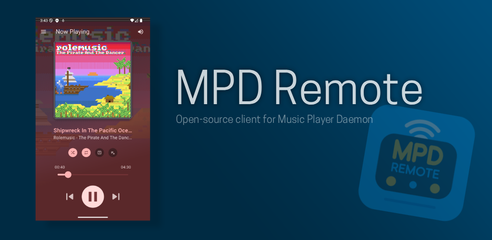
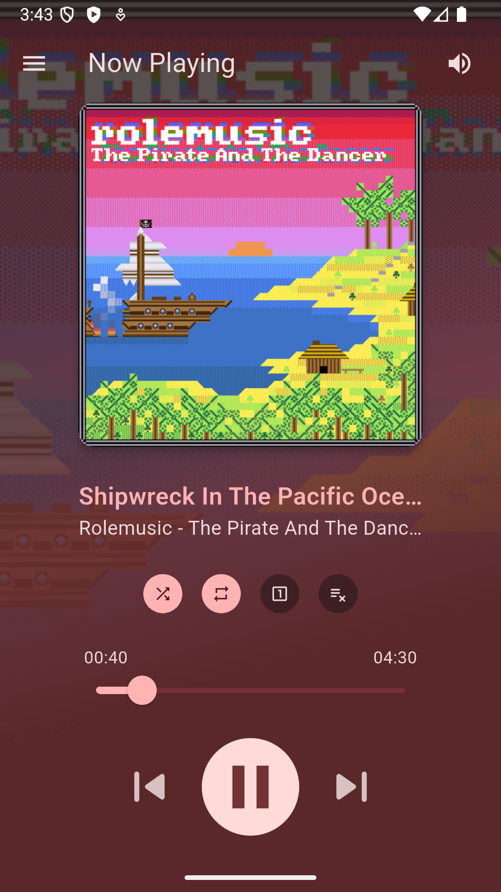
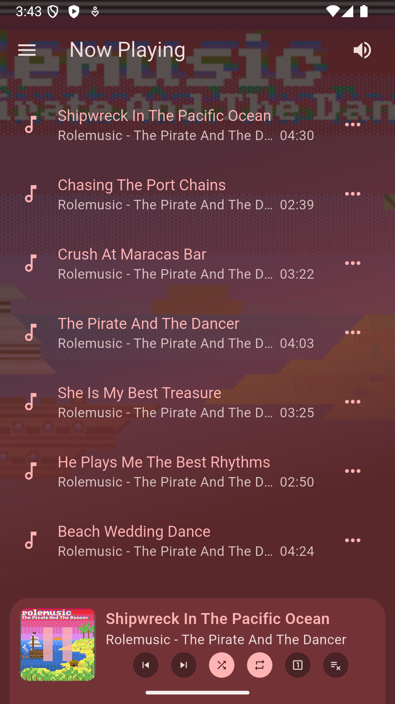
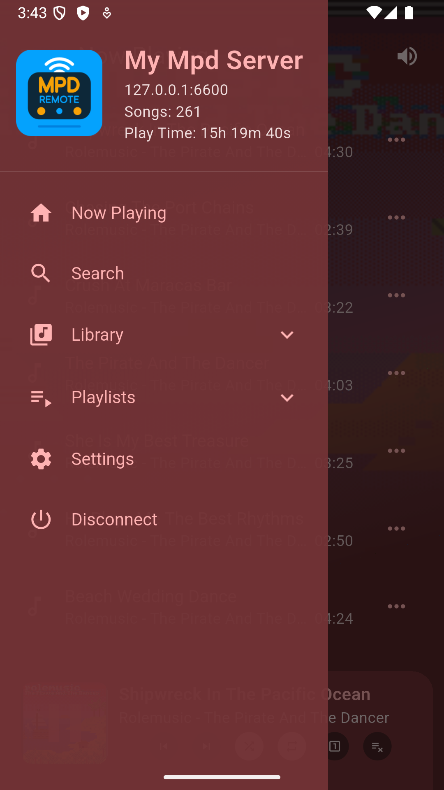
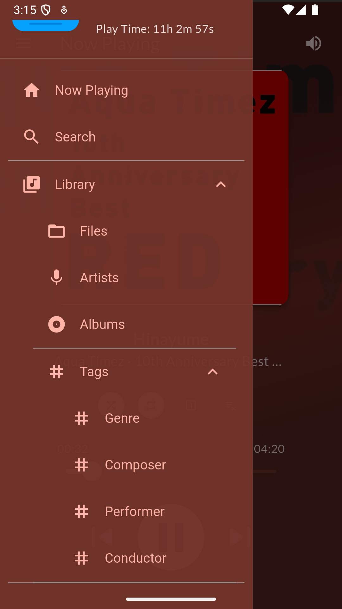
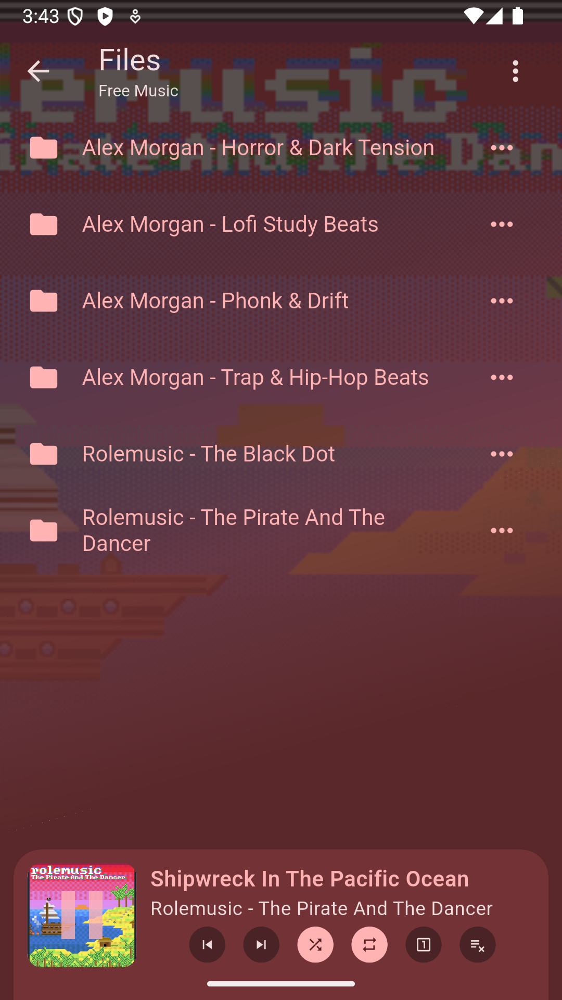
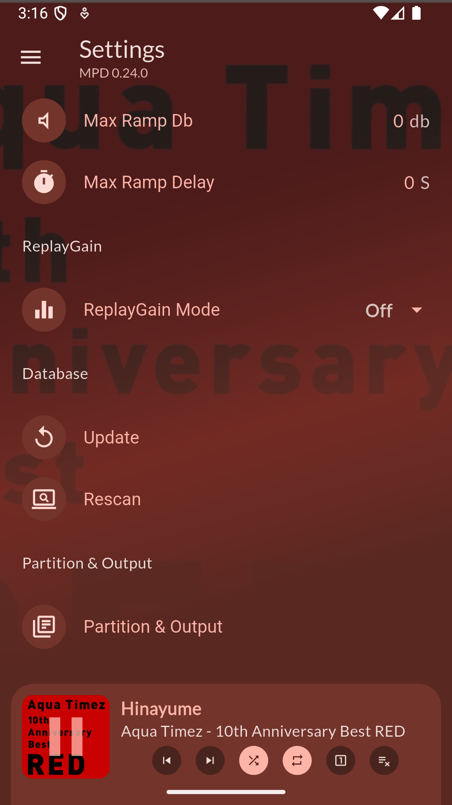

# MPD Remote
  

  

MPD Remote is an open-source client for [Music Player Daemon (MPD)](https://www.musicpd.org/), built with [Flutter](https://flutter.dev/).

## Platforms

- **Tested:** Android, Windows
- **Buildable but not yet tested:** iOS, macOS, Linux

## Screenshots

  
  
  
  

  
  

## Features

- Connect to an MPD server over the network
- Browse albums, artists, tags, files, and playlists
- Search your music library
- View the currently playing track
- Control playback and volume
- Continue playback with background media controls
- Manage saved MPD server connections

## Roadmap

Planned features and improvements:

- **Favorites** — save favorite songs for quick access
- **Song shortcuts** — jump directly to an artist or album from a song's context menu
- **Radio streaming** — listen to internet radio stations via the TuneIn API
- **MPD stream to device** — stream audio directly from your MPD server to your phone

## Requirements

- An Android device
- A running MPD server
- Network access between the Android device and MPD server

## Building from source
1. Install the [Flutter SDK](https://docs.flutter.dev/get-started/install)
2. `flutter pub get`
3. `flutter run`  (or `flutter build apk --release`)

## Contributing
Contributions are welcome! Open an issue or submit a pull request.

## License
MPD Remote is licensed under the [GNU General Public License v3.0](LICENSE).
